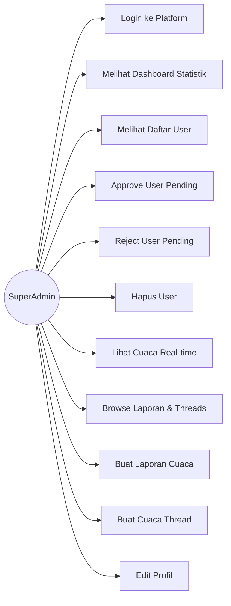
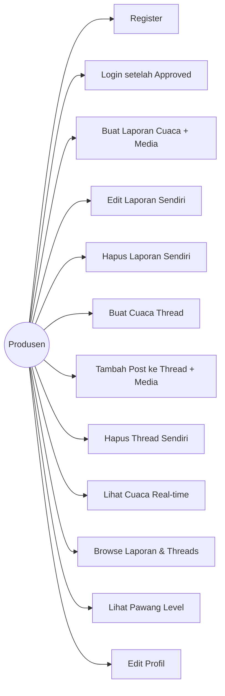
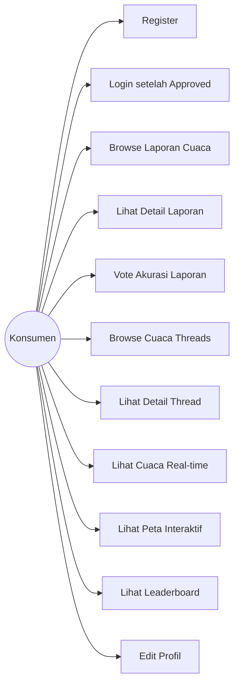
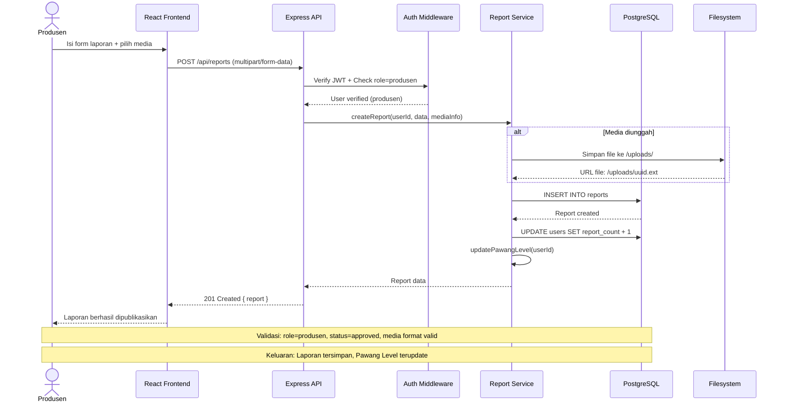
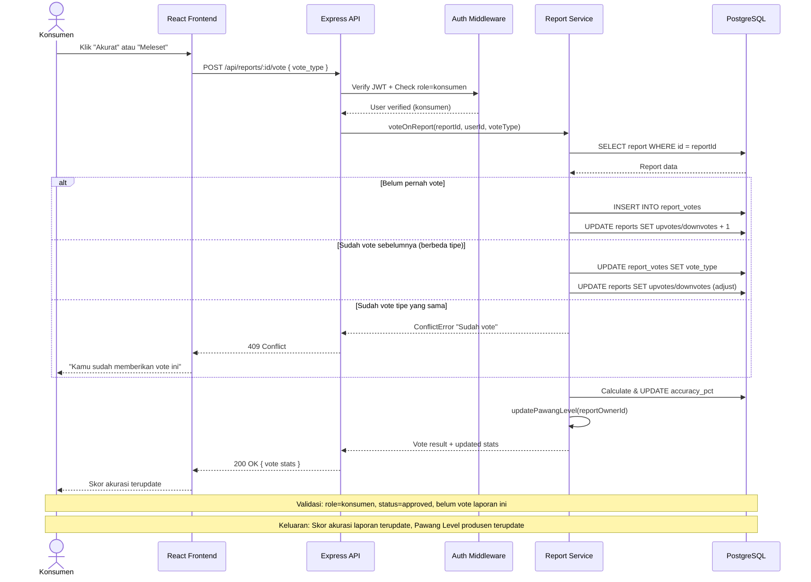
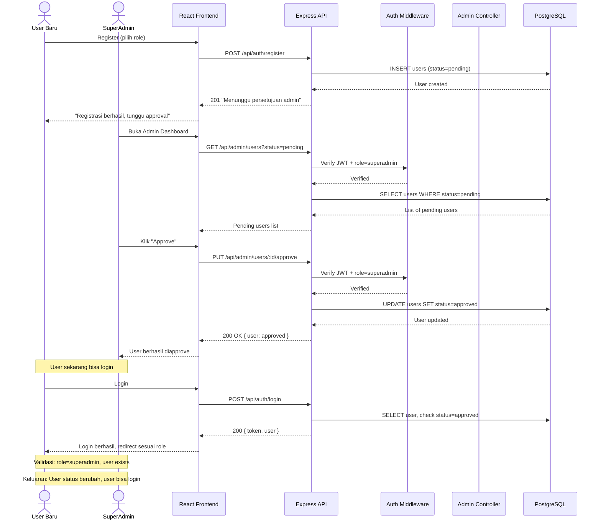
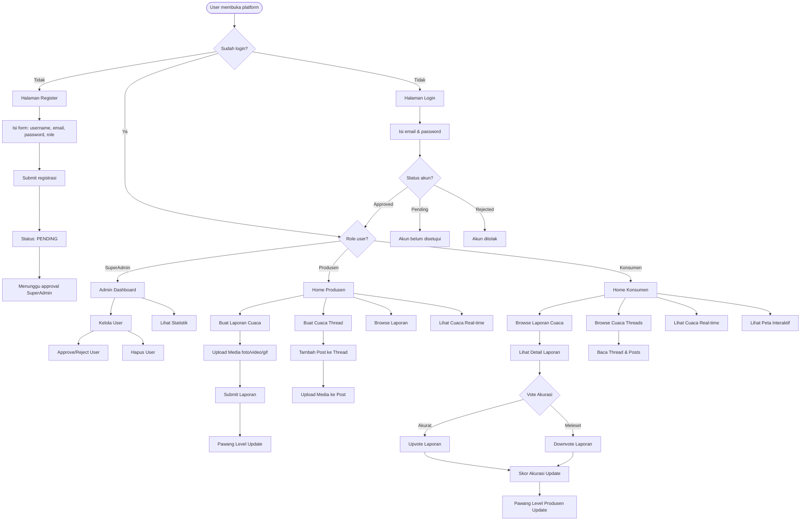
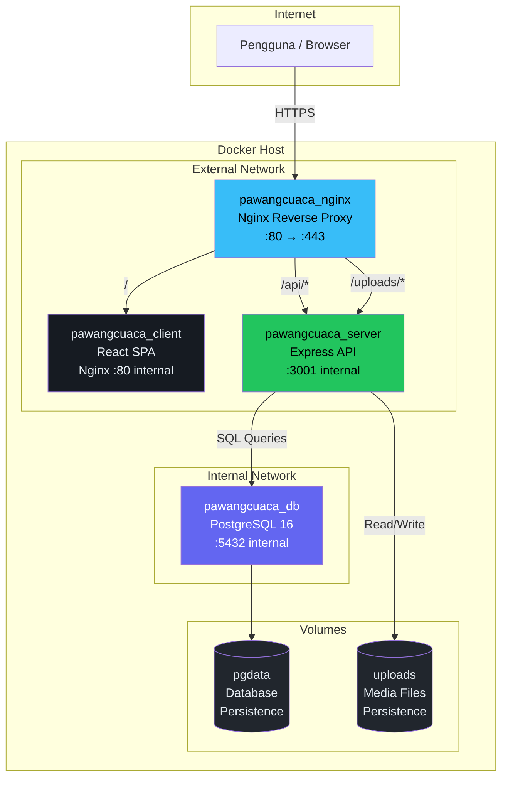

# PawangCuaca — Diagram & Dokumentasi Teknis

---

## 1. Use Case Diagram per Role

### SuperAdmin

### Produsen

### Konsumen

---

## 2. Sequence Diagrams

### 2.1 Sequence: Produsen Membuat Laporan Cuaca

### 2.2 Sequence: Konsumen Vote Akurasi Laporan

### 2.3 Sequence: SuperAdmin Approve User

---

## 3. System Flowchart — Alur Interaksi Fungsi Platform

### 3.1 Flowchart Utama

### 3.2 Rasionalisasi Pemisahan Fungsi

Pemisahan fungsi pada platform ini didasarkan pada prinsip **separation of concerns** dan **principle of least privilege**:

1. **Autentikasi & Otorisasi** dipisahkan dari logika bisnis — middleware menangani verifikasi JWT dan role check sebelum request mencapai controller
2. **CRUD Laporan** vs **CRUD Thread** dipisahkan karena keduanya memiliki siklus hidup dan relasi data yang berbeda — Laporan bersifat standalone, Thread bersifat serial/naratif
3. **Voting** dipisahkan dari pembuatan konten karena melibatkan aktor berbeda (Konsumen vs Produsen) dan memiliki validasi berbeda (cek duplikasi vote)
4. **Admin Management** diisolasi karena hanya relevan untuk SuperAdmin dan menyangkut keamanan (pengelolaan akses)
5. **Pawang Level** sebagai service terpisah karena melibatkan kalkulasi yang dipanggil dari berbagai tempat (saat buat laporan, saat di-vote, dll)

---

## 4. Tabel Penjelasan Fungsi Sistem

| Nama Fungsi | Role Pengguna | Masukan | Penjelasan | Validasi | Keluaran |
|---|---|---|---|---|---|
| Register | Public | username, email, password, role | Mendaftarkan user baru dengan status pending | Email unik, username unik, role = produsen/konsumen, password ≥ 6 char | User terdaftar (status: pending) |
| Login | Public | email, password | Autentikasi user dan mengeluarkan JWT | Email terdaftar, password cocok, status = approved | JWT token + data user |
| Approve User | SuperAdmin | user_id | Mengubah status user menjadi approved | Role = superadmin, user exists, user status = pending/rejected | User status = approved |
| Reject User | SuperAdmin | user_id | Mengubah status user menjadi rejected | Role = superadmin, user exists | User status = rejected |
| Delete User | SuperAdmin | user_id | Menghapus user dari sistem | Role = superadmin, user ≠ diri sendiri | User terhapus |
| Buat Laporan | Produsen | title, description, weather_condition, temperature, lat, lon, media file | Membuat laporan cuaca baru dengan media | Role = produsen, status = approved, media format valid (jpg/png/gif/mp4/webm), image ≤ 10MB, video ≤ 50MB | Laporan terpublikasi, Pawang Level terupdate |
| Edit Laporan | Produsen | report_id, fields to update | Mengedit laporan milik sendiri | Role = produsen, user = pemilik laporan | Laporan terupdate |
| Hapus Laporan | Produsen, SuperAdmin | report_id | Menghapus laporan | Role = produsen (pemilik) atau superadmin | Laporan terhapus, report_count terupdate |
| Vote Akurasi | Konsumen | report_id, vote_type | Memberikan vote akurasi pada laporan | Role = konsumen, status = approved, belum vote laporan ini (unique constraint) | Skor akurasi terupdate, Pawang Level produsen terupdate |
| Buat Thread | Produsen | title, lat, lon | Membuat thread cuaca baru | Role = produsen, status = approved | Thread terbuat |
| Tambah Post | Produsen | thread_id, content, weather_condition, temperature, media file | Menambah post ke thread yang ada | Role = produsen, status = approved, thread exists | Post terbuat, report_count terupdate, Pawang Level terupdate |
| Hapus Thread | Produsen, SuperAdmin | thread_id | Menghapus/archived thread | Role = produsen (pemilik) atau superadmin | Thread status = archived |
| Lihat Cuaca | Semua Auth | lat, lon | Mengambil data cuaca real-time dari Open-Meteo API | lat/lon valid, user authenticated | Data cuaca current + forecast 12 jam |
| Lihat Profil | Semua Auth | — | Melihat dan mengedit profil sendiri | User authenticated | Data profil user + Pawang Level |
| Lihat Pawang Level | Semua Auth | user_id | Melihat level reputasi produsen | User authenticated | Level, report_count, accuracy_score, next level info |

---

## 5. Diagram Arsitektur Sistem Docker

### Penjelasan Arsitektur

1. **Nginx (Reverse Proxy)** — Satu-satunya container yang expose port ke host. Menerima semua traffic dari internet dan me-route ke container yang tepat.
2. **Client Container** — Berisi React build yang di-serve oleh Nginx internal. Hanya bisa diakses melalui reverse proxy.
3. **Server Container** — Express API yang menangani semua logika bisnis. Terhubung ke dua network: external (untuk menerima request dari Nginx) dan internal (untuk akses database).
4. **DB Container** — PostgreSQL yang hanya bisa diakses dari internal network. Tidak pernah terekspos ke internet.
5. **Volumes** — Data persisten untuk database (`pgdata`) dan file upload (`uploads`) agar tidak hilang saat container di-restart.
